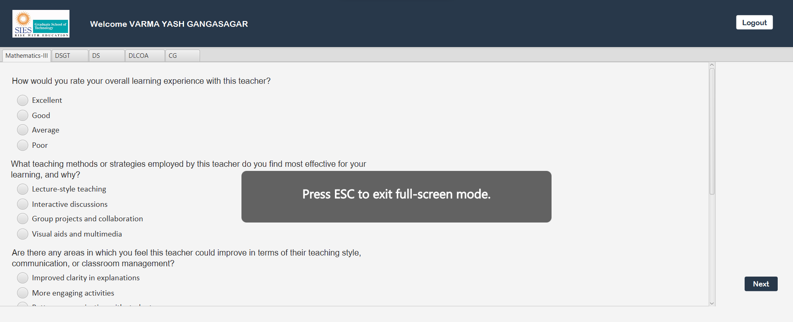

# FeedbackForm
A Feedback Form made using Java and JavaFX

It was a mini-project where our team planned to make an implicit feedback form but we couldn't make it complete but we have done best of parts of it such as Login, Logout, Form Structure, Submit and then calculating and displaying a complete report!

We used .fxml files to prepare the appearance/UI of the complete form!

# Preview




# Steps for installation
1.  You Must have JAVA installed in your system
2.  You can download the ZIP file or you can clone the repository!
    <br>
  a. <a href="https://github.com/yashgv/FeedbackForm">ZIP Download</a> 
     Extract it and run the Run.bat file
    <br>
                OR
    <br>
  b. You must have git installed in your system
    Type the following command in command prompt:
    Change the path where you want to store
    
    ```
    cd <YourPath>
    ```
    ```
    git clone https://github.com/yashgv/FeedbackForm.git
    ```
    Then run the Run.bat file!
3. Enjoy!

### Socials

1. Instagram: https://instagram.com/_ritxvik_
2. Website: https://rithvikshetty.in
3. Linkedin: https://linkedin.com/rithvikshetty

## Contributers

<a href="https://github.com/rithvikshettyy/Object-Measurement/graphs/contributors">
  
</a>
